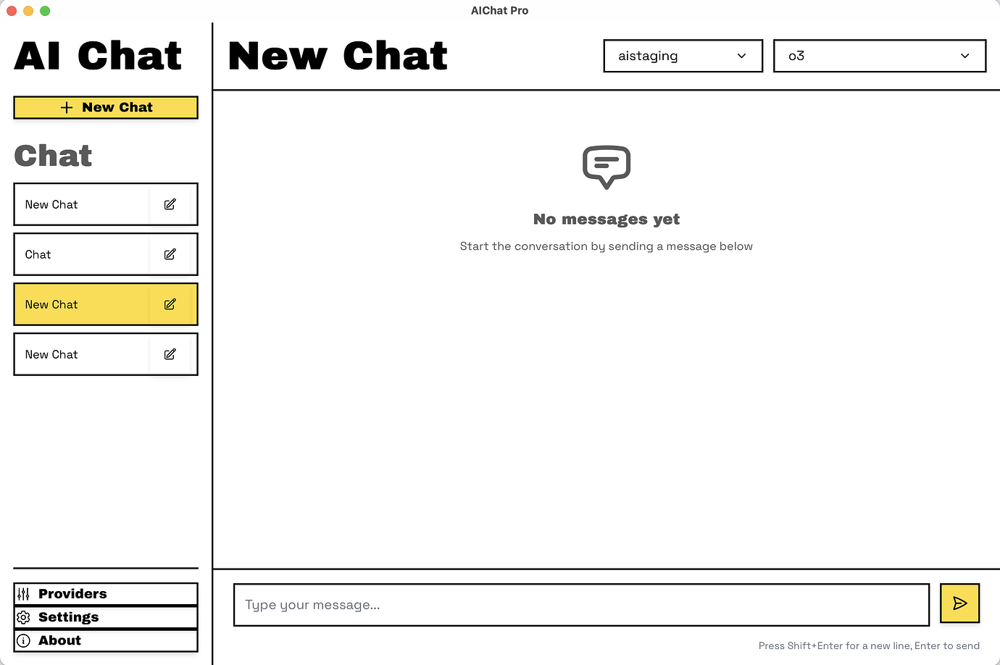

# AIChat Pro

<div align="center">


**Professional AI Chat Application with Multiple Provider Support**

[](https://opensource.org/licenses/MIT)
[](https://github.com/jiji262/aichat-pro)
[](https://tauri.app/)
[](https://reactjs.org/)

[English](README.md) | [中文](README_zh.md)

</div>

## ✨ Features

- 🤖 **Multiple AI Providers** - Support for OpenAI, Gemini, DeepSeek, Grok, and custom providers
- 🎨 **Modern UI** - Clean and intuitive interface with dark/light theme support
- 🌍 **Internationalization** - Full support for English and Chinese languages
- 👥 **Custom Assistants** - Create and manage personalized AI assistants
- 💬 **Chat Management** - Organize conversations with session management
- 🔧 **Provider Management** - Easy setup and configuration of AI providers
- 📱 **Cross-Platform** - Available for macOS, Windows, and Linux
- 🔒 **Privacy First** - All data stored locally on your device

## � Screenshots

<div align="center">

### Chat Interface

*Clean and intuitive chat interface with multiple AI providers*

</div>

## �🚀 Quick Start

### Prerequisites

- [Node.js](https://nodejs.org/) (v18 or later)
- [Rust](https://rustup.rs/) (latest stable)
- [pnpm](https://pnpm.io/) (recommended) or npm

### Installation

1. **Clone the repository**
   ```bash
   git clone https://github.com/jiji262/aichat-pro.git
   cd aichat-pro
   ```

2. **Install dependencies**
   ```bash
   pnpm install
   ```

3. **Run in development mode**
   ```bash
   pnpm tauri dev
   ```

4. **Build for production**
   ```bash
   pnpm tauri build
   ```

## 📦 Download

### Pre-built Binaries

- **macOS**: Download `.dmg` from [Releases](https://github.com/jiji262/aichat-pro/releases)
- **Windows**: Download `.msi` from [Releases](https://github.com/jiji262/aichat-pro/releases)
- **Linux**: Download `.AppImage` from [Releases](https://github.com/jiji262/aichat-pro/releases)

## 🌟 Key Features Showcase

### 🤖 Multiple AI Provider Support
AIChat Pro seamlessly integrates with various AI providers, allowing you to switch between different models and compare responses. Each provider can be configured with custom API endpoints and authentication.

**Fully Supported Providers:**
- ✅ **OpenAI** - GPT-4, GPT-3.5 Turbo, and all OpenAI models
- ✅ **DeepSeek** - DeepSeek-V2, DeepSeek-Coder (OpenAI-compatible API)
- ✅ **Grok (X.AI)** - Grok models (OpenAI-compatible API)
- ✅ **Custom Providers** - Any OpenAI-compatible API endpoint

**Partially Supported:**
- 🟡 **Google Gemini** - Gemini Pro, Flash (native API, limited model discovery)

### 🎨 Modern & Intuitive Interface
The application features a clean, modern design with support for both dark and light themes. The interface is designed to be intuitive and user-friendly, making AI interactions effortless.

### 🌍 Full Internationalization
Complete support for English and Chinese languages with easy switching in settings. All UI elements, messages, and interactions are fully localized.

### 👥 Custom AI Assistants
Create specialized AI assistants with custom system prompts for different use cases - whether you need a coding assistant, writing helper, or domain expert.

## 🔧 Configuration

### Adding AI Providers

1. Navigate to the **Providers** page
2. Click **Add Provider**
3. Select provider type (OpenAI, Gemini, DeepSeek, Grok, or Custom)
4. Enter your API credentials
5. Click **Fetch Models** to load available models

### Supported Providers

| Provider | API Compatibility | Models Support |
|----------|------------------|----------------|
| **OpenAI** | Native | GPT-4, GPT-3.5, etc. |
| **DeepSeek** | OpenAI Compatible | DeepSeek models |
| **Grok** | OpenAI Compatible | Grok models |
| **Gemini** | Native | Gemini Pro, Flash |
| **Custom** | OpenAI Compatible | Any compatible API |

## 🎯 Usage Guide

### 💬 Starting a Chat

1. **Navigate to Chat**: Go to the **Chat** page from the sidebar
2. **Select Provider**: Choose your preferred AI provider from the dropdown
3. **Pick a Model**: Select the specific model you want to use
4. **Start Chatting**: Type your message and press Enter
5. **Enjoy**: Experience seamless AI conversations!

*As shown in the chat interface screenshot above, you can easily switch between providers and models mid-conversation.*

### 👥 Creating Custom Assistants

1. **Open Assistants**: Navigate to the **Assistants** page
2. **Add New**: Click the **Add Assistant** button
3. **Configure Details**:
   - Set a descriptive name
   - Add a helpful description
   - Write a custom system prompt
4. **Save & Use**: Your assistant will be available in chat sessions

*The assistants management interface allows you to create specialized AI helpers for different tasks.*

### 🔧 Managing Providers

1. **Provider Setup**: Go to **Providers** page
2. **Add Provider**: Click **Add Provider** button
3. **Configure API**: Enter your API credentials and endpoints
4. **Fetch Models**: Click **Fetch Models** to load available options
5. **Test Connection**: Verify everything works correctly

### ⚙️ Customizing Settings

1. **Access Settings**: Navigate to **Settings** page
2. **Theme Selection**: Choose between light and dark themes
3. **Language**: Switch between English and Chinese (中文)
4. **Preferences**: Adjust other application preferences

*All changes take effect immediately without requiring a restart.*

## 🛠️ Development

### Tech Stack

- **Frontend**: React 18, React Router, Tailwind CSS
- **Backend**: Rust, Tauri 2.0
- **Database**: SQLite (via Rusqlite)
- **HTTP Client**: Reqwest
- **Build Tool**: Vite

### Project Structure

```
aichat-pro/
├── src/                    # React frontend
│   ├── components/         # Reusable components
│   ├── pages/             # Page components
│   ├── i18n/              # Internationalization
│   └── styles/            # CSS styles
├── src-tauri/             # Rust backend
│   ├── src/               # Rust source code
│   ├── icons/             # App icons
│   └── Cargo.toml         # Rust dependencies
└── dist/                  # Built frontend assets
```

### Contributing

1. Fork the repository
2. Create a feature branch (`git checkout -b feature/amazing-feature`)
3. Commit your changes (`git commit -m 'Add amazing feature'`)
4. Push to the branch (`git push origin feature/amazing-feature`)
5. Open a Pull Request

## 📄 License

This project is licensed under the MIT License - see the [LICENSE](LICENSE) file for details.

## 🙏 Acknowledgments

- [Tauri](https://tauri.app/) - For the amazing desktop app framework
- [React](https://reactjs.org/) - For the powerful UI library
- [Tailwind CSS](https://tailwindcss.com/) - For the utility-first CSS framework
- All the AI providers for their excellent APIs

## 📞 Support

- 🐛 **Bug Reports**: [GitHub Issues](https://github.com/jiji262/aichat-pro/issues)
- 💡 **Feature Requests**: [GitHub Discussions](https://github.com/jiji262/aichat-pro/discussions)

---
