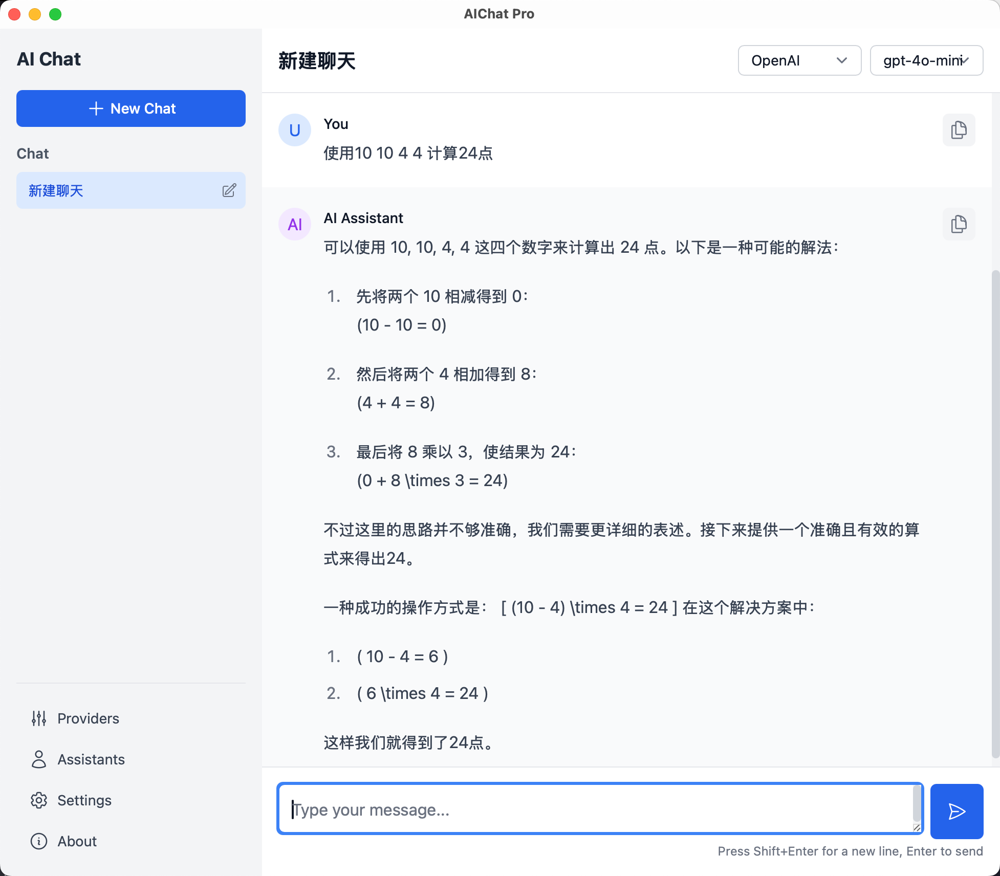

# AIChat Pro

<div align="center">


**专业的多AI提供商聊天应用程序**

[](https://opensource.org/licenses/MIT)
[](https://github.com/jiji262/aichat-pro)
[](https://tauri.app/)
[](https://reactjs.org/)

[English](README.md) | [中文](README_zh.md)

</div>

## ✨ 功能特性

- 🤖 **多AI提供商** - 支持OpenAI、Gemini、DeepSeek、Grok和自定义提供商
- 🎨 **现代化界面** - 简洁直观的界面，支持深色/浅色主题
- 🌍 **国际化支持** - 完整支持中文和英文界面
- 👥 **自定义助手** - 创建和管理个性化AI助手
- 💬 **聊天管理** - 通过会话管理组织对话
- 🔧 **提供商管理** - 轻松设置和配置AI提供商
- 📱 **跨平台** - 支持macOS、Windows和Linux
- 🔒 **隐私优先** - 所有数据本地存储在您的设备上

## 📸 应用截图

<div align="center">

### 聊天界面

*简洁直观的聊天界面，支持多个AI提供商*

### 提供商管理

*轻松设置和配置AI提供商*

### 自定义助手

*创建和管理个性化AI助手*

### 设置和主题

*深色/浅色主题支持和语言设置*

</div>

## 🚀 快速开始

### 环境要求

- [Node.js](https://nodejs.org/) (v18或更高版本)
- [Rust](https://rustup.rs/) (最新稳定版)
- [pnpm](https://pnpm.io/) (推荐) 或 npm

### 安装步骤

1. **克隆仓库**
   ```bash
   git clone https://github.com/jiji262/aichat-pro.git
   cd aichat-pro
   ```

2. **安装依赖**
   ```bash
   pnpm install
   ```

3. **开发模式运行**
   ```bash
   pnpm tauri dev
   ```

4. **生产环境构建**
   ```bash
   pnpm tauri build
   ```

## 📦 下载

### 预编译版本

- **macOS**: 从 [Releases](https://github.com/jiji262/aichat-pro/releases) 下载 `.dmg` 文件
- **Windows**: 从 [Releases](https://github.com/jiji262/aichat-pro/releases) 下载 `.msi` 文件
- **Linux**: 从 [Releases](https://github.com/jiji262/aichat-pro/releases) 下载 `.AppImage` 文件

## 🌟 核心功能展示

### 🤖 多AI提供商支持
AIChat Pro 无缝集成多种AI提供商，让您可以在不同模型之间切换并比较响应结果。每个提供商都可以配置自定义API端点和身份验证。

### 🎨 现代直观界面
应用采用简洁现代的设计，支持深色和浅色主题。界面设计直观友好，让AI交互变得轻松自然。

### 🌍 完整国际化支持
完全支持中文和英文语言，可在设置中轻松切换。所有UI元素、消息和交互都已完全本地化。

### 👥 自定义AI助手
为不同用例创建专门的AI助手，配置自定义系统提示 - 无论您需要编程助手、写作帮手还是领域专家。

## 🔧 配置

### 添加AI提供商

1. 导航到 **提供商** 页面
2. 点击 **添加提供商**
3. 选择提供商类型（OpenAI、Gemini、DeepSeek、Grok或自定义）
4. 输入您的API凭据
5. 点击 **获取模型** 加载可用模型

### 支持的提供商

| 提供商 | API兼容性 | 模型支持 |
|--------|----------|---------|
| **OpenAI** | 原生 | GPT-4、GPT-3.5等 |
| **DeepSeek** | OpenAI兼容 | DeepSeek模型 |
| **Grok** | OpenAI兼容 | Grok模型 |
| **Gemini** | 原生 | Gemini Pro、Flash |
| **自定义** | OpenAI兼容 | 任何兼容的API |

## 🎯 使用指南

### 💬 开始聊天

1. **进入聊天页面**: 从侧边栏进入 **聊天** 页面
2. **选择提供商**: 从下拉菜单中选择您偏好的AI提供商
3. **选择模型**: 选择您想要使用的具体模型
4. **开始对话**: 输入您的消息并按回车键
5. **享受体验**: 体验无缝的AI对话！

*如上方聊天界面截图所示，您可以在对话过程中轻松切换提供商和模型。*

### 👥 创建自定义助手

1. **打开助手页面**: 导航到 **助手** 页面
2. **添加新助手**: 点击 **添加助手** 按钮
3. **配置详情**:
   - 设置描述性名称
   - 添加有用的描述
   - 编写自定义系统提示
4. **保存使用**: 您的助手将在聊天会话中可用

*助手管理界面允许您为不同任务创建专门的AI帮手。*

### 🔧 管理提供商

1. **提供商设置**: 进入 **提供商** 页面
2. **添加提供商**: 点击 **添加提供商** 按钮
3. **配置API**: 输入您的API凭据和端点
4. **获取模型**: 点击 **获取模型** 加载可用选项
5. **测试连接**: 验证一切正常工作

### ⚙️ 自定义设置

1. **访问设置**: 导航到 **设置** 页面
2. **主题选择**: 在浅色和深色主题之间选择
3. **语言设置**: 在英文和中文之间切换
4. **偏好设置**: 调整其他应用程序偏好

*所有更改立即生效，无需重启应用。*

## 🛠️ 开发

### 技术栈

- **前端**: React 18、React Router、Tailwind CSS
- **后端**: Rust、Tauri 2.0
- **数据库**: SQLite (通过 Rusqlite)
- **HTTP客户端**: Reqwest
- **构建工具**: Vite

### 项目结构

```
aichat-pro/
├── src/                    # React前端
│   ├── components/         # 可复用组件
│   ├── pages/             # 页面组件
│   ├── i18n/              # 国际化
│   └── styles/            # CSS样式
├── src-tauri/             # Rust后端
│   ├── src/               # Rust源代码
│   ├── icons/             # 应用图标
│   └── Cargo.toml         # Rust依赖
└── dist/                  # 构建的前端资源
```

### 贡献

1. Fork 仓库
2. 创建功能分支 (`git checkout -b feature/amazing-feature`)
3. 提交更改 (`git commit -m 'Add amazing feature'`)
4. 推送到分支 (`git push origin feature/amazing-feature`)
5. 打开 Pull Request

## 📄 许可证

本项目采用 MIT 许可证 - 查看 [LICENSE](LICENSE) 文件了解详情。

## 🙏 致谢

- [Tauri](https://tauri.app/) - 出色的桌面应用框架
- [React](https://reactjs.org/) - 强大的UI库
- [Tailwind CSS](https://tailwindcss.com/) - 实用优先的CSS框架
- 所有AI提供商提供的优秀API

## 📞 支持

- 🐛 **错误报告**: [GitHub Issues](https://github.com/jiji262/aichat-pro/issues)
- 💡 **功能请求**: [GitHub Discussions](https://github.com/jiji262/aichat-pro/discussions)
- 📧 **邮箱**: support@aichatpro.com

---

<div align="center">
由 AIChat Pro 团队用 ❤️ 制作
</div>
